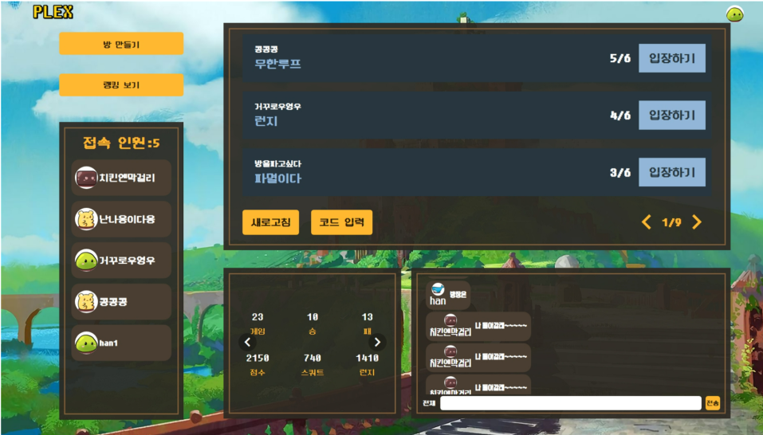
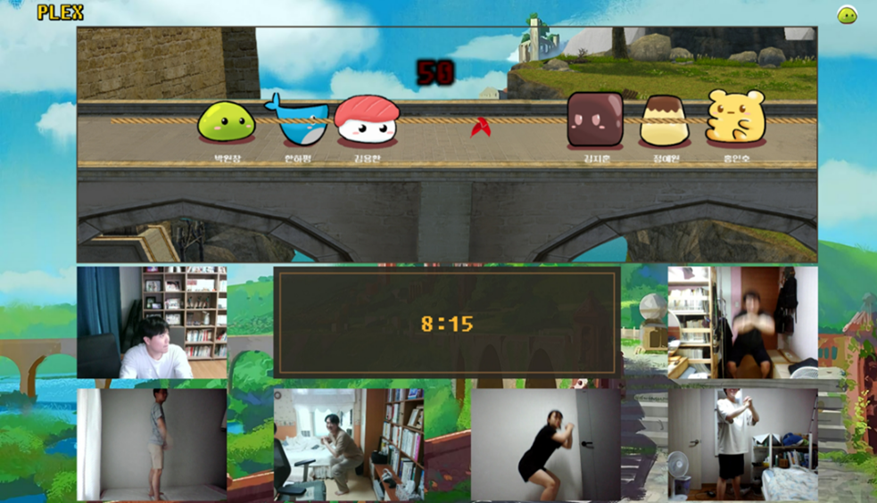
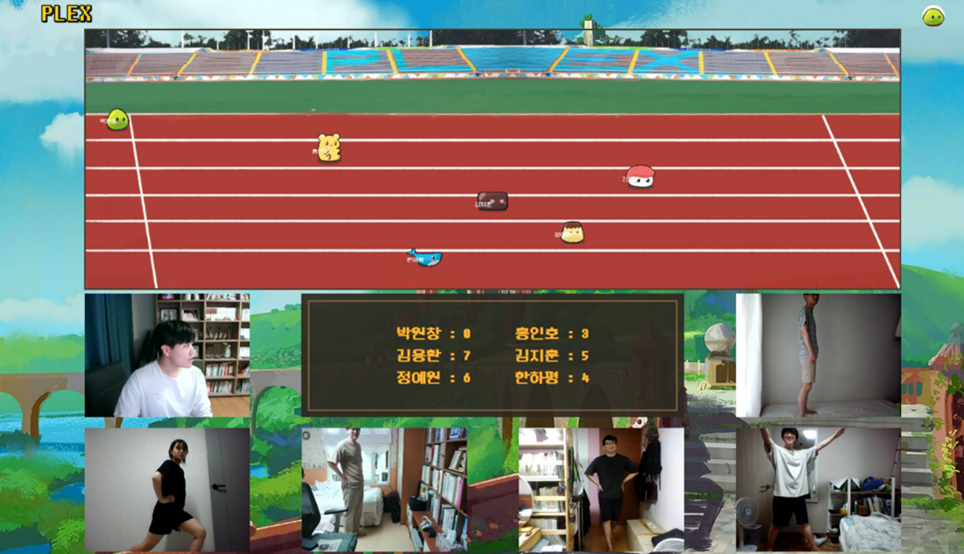
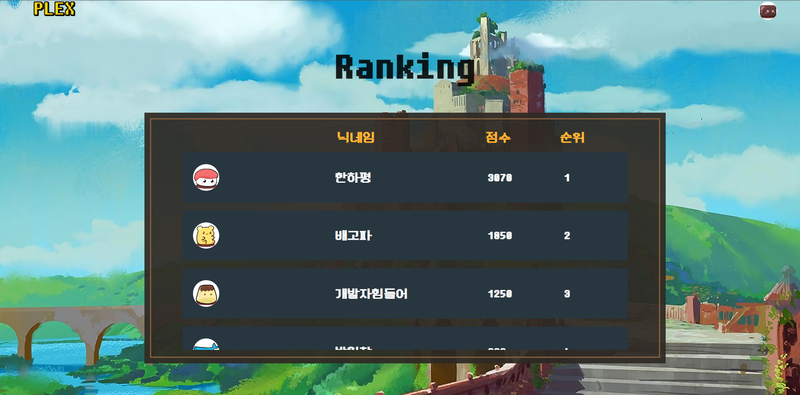
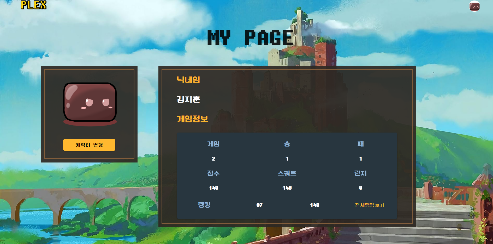
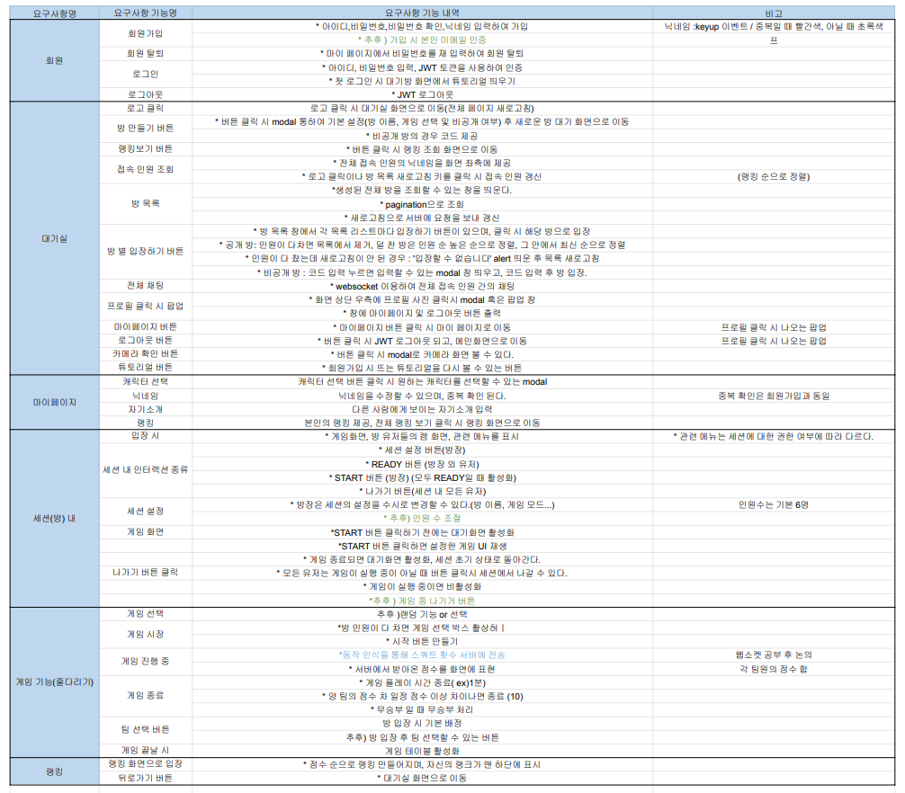
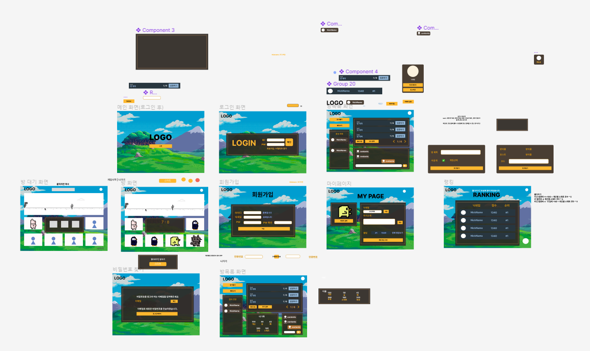
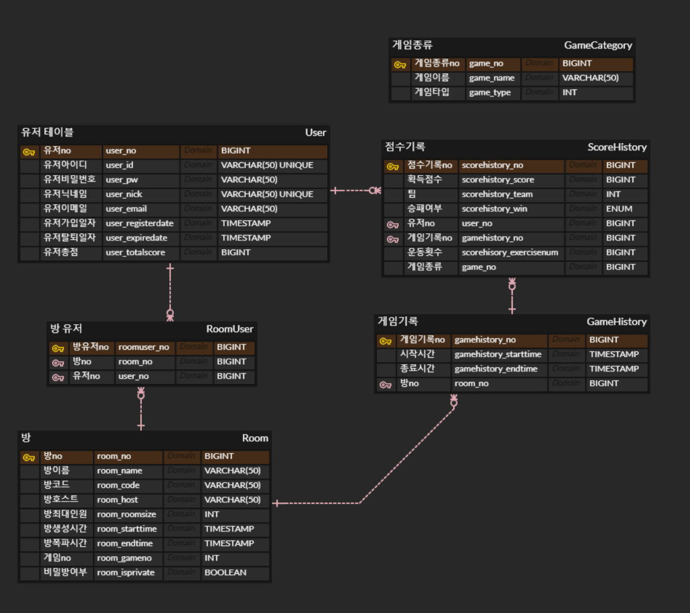

# 🏃‍♂️ PLEX 🏃‍♀️

# 🎮 PLEX 소개

Play Excercise(이하 PLEX) 는 비가 오나 눈이 오나 상관없이 집에서 재미있게 할 수 있는 온라인 운동 게임입니다. 서비스에 접속한 모든 사용자와 같이 플레이할 수 있습니다. 대전형식, 랭크 시스템을 도입하여 재미와 운동욕구를 불러일으켜 최종적으로는 PLEX 서비스를 통해 즐겁게, 꾸준히 운동을 하도록 유도하는 것이 목적입니다.

# ☔ 기획 배경

건강관리를 중요하게 생각하는 현대인들에게 날씨나 코로나로 인해  야외 활동이 어려운 상황에서 동기부여를 하며 운동을 즐기며 할 수 있게 해주는 서비스를 기획하고자 했습니다.

# 서비스 화면

순서대로 로그인 전의 메인화면, 로그인 화면, 대기실, 게임 시연 화면 1 (줄다리기), 게임 시연 화면 2 (달리기), 랭킹홈 입니다.

메인화면

대기실 화면

줄다리기 게임(3대3 팀전) 화면

달리기 게임(개인전) 화면

랭킹 화면

마이페이지 화면

## 게임 컨텐츠 소개

### 1. 단체전 (줄다리기)

팀전은 3대 3으로 진행됩니다. 60초동안 스쿼트를 진행하여 합계 점수가 높은 팀이 승리합니다. 만약 60초 내에 두 팀의 스쿼트 횟수 차이가 10회가 넘어간다면 게임이 종료되게 됩니다.

### 2. 개인전 (달리기)

런지 운동을 통해 캐릭터를 트랙의 결승선까지 빠르게 이동시키는 것이 게임의 목표입니다. 10점을 먼저 달성하는 플레이어가 나오면 게임이 종료됩니다.

# 사용 기술

## 프론트엔드

- Vue.js
- WebRTC - OpenVidu
  - OpenVidu 기본 기능에 더해 방 인원수 최대 6명 제한, 게임 중 난입 방지, 팀 선택 기능, 방장에게만 시작 권한 부여, 비공개 방 생성 시 코드 입장 기능을 구현했습니다.
- Phaser3
  - Phaser는 웹 기반 2D 게임을 만들 수 있는 JavaScript 게임 프레임워크입니다. Teachable Machine을 이용하여 학습한 모델에 웹캠을 이용하여 운동 횟수를 카운트하고, 해당 정보와 연동되어 게임 시스템이 동작하도록 구현했습니다.

## 백엔드

- SpringBoot
- docker
- Teachable Machine
  - 스쿼트와 런지 자세를 학습시킨 모델로 각 유저가 운동을 수행했는지 체크하고, 횟수를 카운트할 수 있도록 했습니다.

# 개발 환경

- Backend
  - IntelliJ
  - Spring
  - MySQL
  - AWS EC2
  - Redis
- Frontend
  - VS code
  - Vue.js
- Web RTC
  - Openvidu
- Pose Detection
  - Teachable Machine
- Game
  - Phaser3
- CI/CD
  - docker
  - Nginx
- 협업 툴
  - Git
  - Jira
  - Notion
  - Mattermost
  - Webex

# 요구사항 정의서

# 화면 설계서

# ER Diagram

# 이미지, 음원 출처

- 캐릭터 디자인 원본 - 골드메탈

[https://assetstore.unity.com/packages/2d/characters/bolt-2d-jellyfarm-assets-pack-188722](https://assetstore.unity.com/packages/2d/characters/bolt-2d-jellyfarm-assets-pack-188722)

- 음원
  - 열혈행진곡_8비트 - 브금저장소
  - 벌룬_파이트_8비트 - 브금저장소
  - 테트리스_브금_8비트 - 브금저장소
  - 캉캉_8비트 - 브금저장소
  - 트윈비_추억_8비트 - 브금저장소
  - 서커스_찰리_8비트 - 브금저장소
  - MP_Blast - [http://soundbible.com/538-Blast.html](http://soundbible.com/538-Blast.html)
  - Crowd Boo And Heckles - [http://soundbible.com/654-Crowd-Boo-And-Heckles.html](http://soundbible.com/654-Crowd-Boo-And-Heckles.html)

# 팀원 역할

- 김용환(팀장) : 프론트엔드
- 김지훈 : 게임 및 프론트엔드
- 박원창 : 백엔드
- 정예원 : 프론트엔드
- 한하평 : 풀스택
- 홍인호 : 게임 및 프론트엔드
